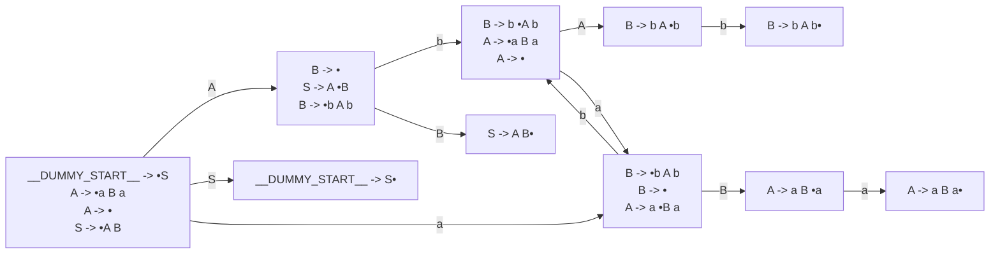

# Generated Info

## Base Info
- config_file: sample.rparser
- output_file: sample.rs
- time: 2023-05-20 11:14:51.918946 +08:00

---

## DFA Graph


---

## Follow Set
```txt
S: ["__$__"]
B: ["__$__", "a"]
__EPSILON__: ["b", "a", "__$__"]
__$__: []
a: ["__$__", "b"]
A: ["__$__", "b"]
b: ["__$__", "a"]
__DUMMY_START__: ["__$__"]
```

---
## Action Table
```txt
State 0:
A: Shift(1)
b: Reduce(ReduceDerivation { left: "A", right: [] })
__$__: Accept
a: Shift(5)
S: Shift(9)
===================
State 1:
a: Reduce(ReduceDerivation { left: "B", right: [] })
__$__: Reduce(ReduceDerivation { left: "B", right: [] })
B: Shift(8)
b: Shift(2)
===================
State 2:
a: Shift(5)
b: Reduce(ReduceDerivation { left: "A", right: [] })
__$__: Reduce(ReduceDerivation { left: "A", right: [] })
A: Shift(3)
===================
State 3:
b: Shift(4)
===================
State 4:
__$__: Reduce(ReduceDerivation { left: "B", right: ["b", "A", "b"] })
a: Reduce(ReduceDerivation { left: "B", right: ["b", "A", "b"] })
===================
State 5:
a: Reduce(ReduceDerivation { left: "B", right: [] })
b: Shift(2)
B: Shift(6)
__$__: Reduce(ReduceDerivation { left: "B", right: [] })
===================
State 6:
a: Shift(7)
===================
State 7:
__$__: Reduce(ReduceDerivation { left: "A", right: ["a", "B", "a"] })
b: Reduce(ReduceDerivation { left: "A", right: ["a", "B", "a"] })
===================
State 8:
__$__: Reduce(ReduceDerivation { left: "S", right: ["A", "B"] })
===================
State 9:
__$__: Reduce(ReduceDerivation { left: "__DUMMY_START__", right: ["S"] })
===================

```
---
generated by rparser
RockRockWhite 2023
    