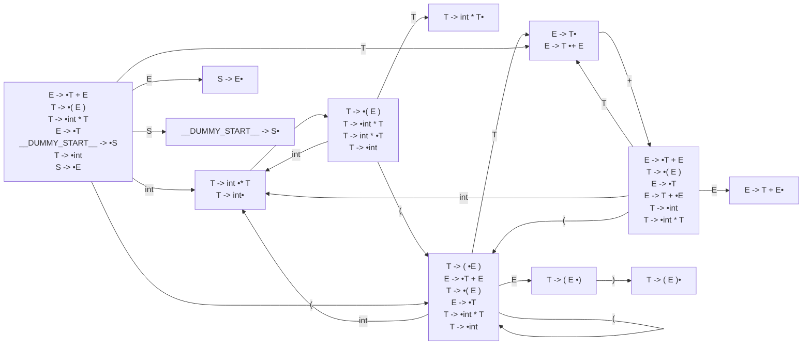

# Generated Info

## Base Info
- config_file: sample.rparser
- output_file: sample.rs
- time: 2023-05-19 15:42:01.862329 +08:00

---

## DFA Graph


---
## Action Table
```json
State 0:
T: Shift(5)
E: Shift(10)
(: Shift(4)
S: Shift(11)
int: Shift(1)
__$__: Accept
===================
State 1:
): Reduce(ReduceDerivation { left: "T", right: ["int"] })
+: Reduce(ReduceDerivation { left: "T", right: ["int"] })
__$__: Reduce(ReduceDerivation { left: "T", right: ["int"] })
*: Shift(2)
===================
State 2:
(: Shift(4)
int: Shift(1)
T: Shift(3)
===================
State 3:
+: Reduce(ReduceDerivation { left: "T", right: ["int", "*", "T"] })
): Reduce(ReduceDerivation { left: "T", right: ["int", "*", "T"] })
__$__: Reduce(ReduceDerivation { left: "T", right: ["int", "*", "T"] })
===================
State 4:
T: Shift(5)
(: Shift(4)
int: Shift(1)
E: Shift(8)
===================
State 5:
+: Shift(6)
): Reduce(ReduceDerivation { left: "E", right: ["T"] })
__$__: Reduce(ReduceDerivation { left: "E", right: ["T"] })
===================
State 6:
T: Shift(5)
(: Shift(4)
int: Shift(1)
E: Shift(7)
===================
State 7:
): Reduce(ReduceDerivation { left: "E", right: ["T", "+", "E"] })
__$__: Reduce(ReduceDerivation { left: "E", right: ["T", "+", "E"] })
===================
State 8:
): Shift(9)
===================
State 9:
): Reduce(ReduceDerivation { left: "T", right: ["(", "E", ")"] })
__$__: Reduce(ReduceDerivation { left: "T", right: ["(", "E", ")"] })
+: Reduce(ReduceDerivation { left: "T", right: ["(", "E", ")"] })
===================
State 10:
__$__: Reduce(ReduceDerivation { left: "S", right: ["E"] })
===================
State 11:
__$__: Reduce(ReduceDerivation { left: "__DUMMY_START__", right: ["S"] })
===================

```
---
generated by rparser
rockrockwhite 2023
    